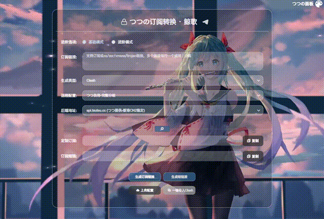

<h1 align="center"><a href="https://sub.tsutsu.cc/" target="_blank">つつの订阅转换</a></h1>

# つつの订阅转换

该仓库供主题制作者使用

## 教程在 [这里](https://github.com/lhl77/subweb-tsutsu/wiki) ！！！

### 爱折腾用户本地搭建教程在 [这里](https://github.com/lhl77/subweb-tsutsu/blob/master/LINUX.md)

## 基础配置文件

> 必须修改

- public
    - setting
        - `setting.js` ：设置主题信息
        - `setting.css` ：设置主题样式

## 高级配置文件

> 可以不修改，不影响最终效果

- public
    - `index.html` ：UA识别，高级背景等设置
- src
    - views
        - `Subconverter.vue` ：可设置subweb内容，远程配置后端配置，网页Title+订阅转换上部显示文字等

# 💻 演示站点

欢迎将你的网站提交到这里来 [直接编辑（推荐）](https://github.com/lhl77/subweb-tsutsu/edit/main/README.md) 或者提交 PR

| 站点                                  | 状态                                                         |
| ------------------------------------- | ------------------------------------------------------------ |
| [Demo](https://demo.sub.tsutsu.cc/)       |  |
| [tsutsu · 鲸歌](https://sub.tsutsu.cc/) |   |
| [tsutsu · 简单的黑](https://b.sub.tsutsu.cc/) |   |
| [tsutsu · 海洋3D](https://o.sub.tsutsu.cc/) |   |
